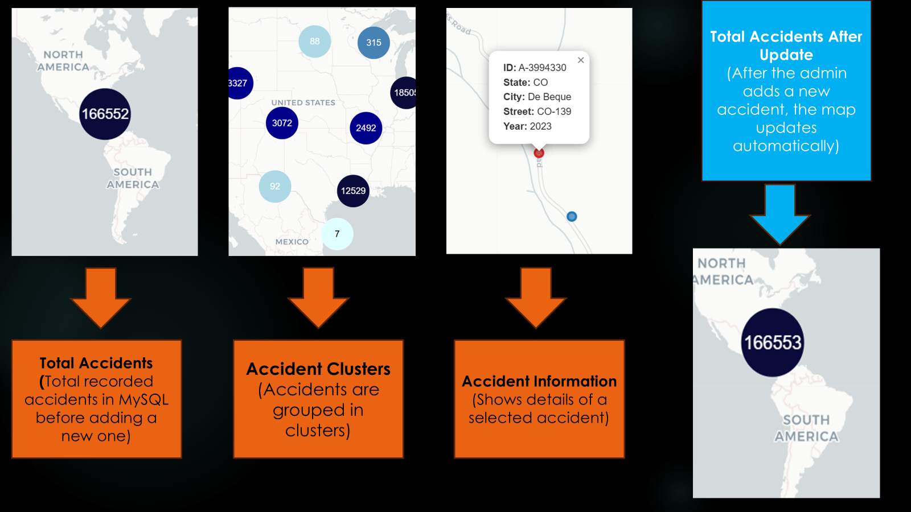
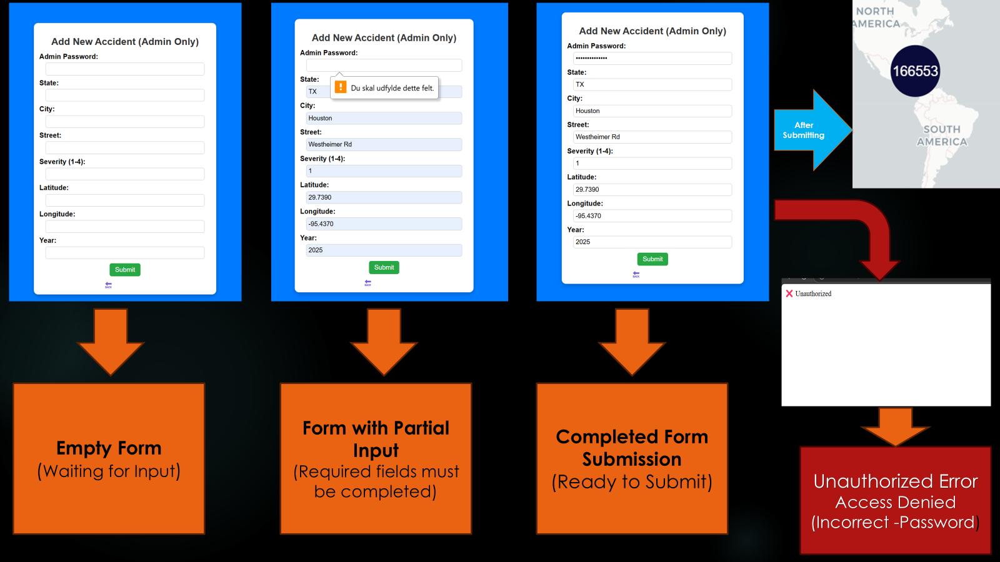

# US Map Accident Visualization

This project is an interactive map that visualizes accident data across the United States using Flask, MySQL, and Folium. The data is retrieved dynamically from a MySQL database and displayed on a map with clustered accident markers. The application consists of two primary functionalities:

Public Map View: Users can view and interact with the accident data on the map.

Admin Page: Authorized users (admins) can add new accidents through a password-protected form.

Automatic Updates: When a new accident is added, the system generate a unique Id for the new accident and the map is automatically updated to display the new data without restarting the application. The new accident is also stored in the database.
##

<strong>Map Screenshots</strong>

  

---

<strong>Admin Panel</strong>

  

---
## 📂 Project Structure

**📁 US_MAP_VISUALIZATION/** 

├── **Main_map.py** → Main script that loads accident data from MySQL and generates an interactive map using Folium
│
├── **config.py** → Stores configuration settings (used to store password) 
│
├── **data_cleaning.ipynb** 
│
├── **📁 templates/** → Stores HTML templates for the web interface.  
│   ├── **view_map.html** → Displays the interactive accident map.  
│   ├── **add_accident.html** → Admin panel for adding new accidents (password protected).  
│
├── **📁 Databases/database/** → Stores database schema  
│   ├── **schema.sql**
│
├── **📁 Datasets/** → Contains raw and cleaned accident datasets 
│   ├── **cleaned_US_Accidents_2023.csv** → Preprocessed dataset used in MySQL
│   ├── **US_Accidents_March23.csv** 
│
├── **📁 images/** → Stores images used in the README.md file 
│
├── .gitignore 
|
└── **README.md**  

 **Dataset:**
**Dataset Source:** US Accidents Dataset (2016 - 2023)
**Dataset Information**
The original dataset contains 7.7 million accident records collected from 2016 to 2023 across 49 states in the USA. For this project, only accidents from 2023 were used. Additionally, admins can manually add new accident records, which will be stored in MySQL and instantly reflected on the map.

 **Set up MySQL database:**  
- Import `schema.sql` into MySQL.
- Load the dataset (`cleaned_US_Accidents_2023.csv`) into the `US_Accidents` table.

 **Access the web app:**  
- View the map: (http://127.0.0.1:5008/)  
- Admin panel: (http://127.0.0.1:5008/add-accident) (Requires password)  

